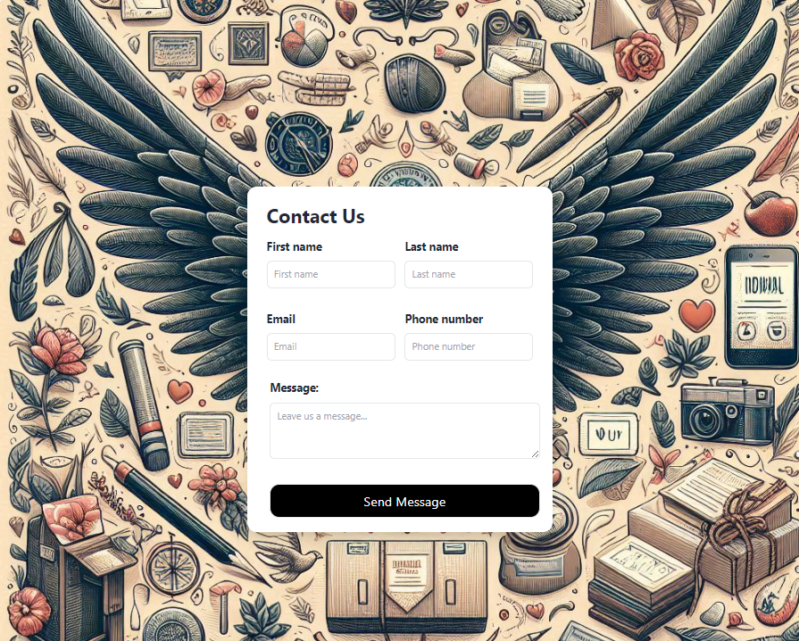
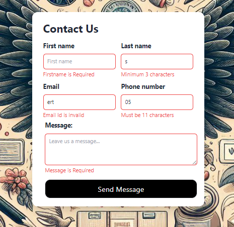

# Contact Form ✉️

This application allows users to submit their contact information and messages to the administrator of the page.

## Features ✨

- 📝 Users can submit their contact information and messages by filling out a form.
- 📧 The submitted contact form is automatically sent to the email address specified by the site administrator.
- 🛠️ User inputs are validated both server-side and client-side, ensuring error messages are displayed to the user if any issues arise.
- 📬 Notifications are used to provide feedback to the user about the submission process.


## Technologies Used 💻


- 💻 [React.js](https://reactjs.org/) - JS library for crafting user interfaces 
- 📦 [Vite](https://vitejs.dev/) - Module bundler 
- 🎨 [Tailwind CSS](https://tailwindcss.com/) - A utility-first CSS framework
- 🚀 [Express.js](https://expressjs.com/) - Web framework for Node.js
- 📧 [Nodemailer](https://nodemailer.com/) - Email sending module for Node.js
- ✅ [React Hook Form](https://www.react-hook-form.com/) - Simple React forms validation
- 🛠️ [Express Validation](https://express-validator.github.io/docs/) - Validation middleware for Express.js
- 📬 [Notistack](https://notistack.com/) - Notification library for React


## Installation 🛠️

Prerequisites

- Install Node.js ⚙️
- Clone the repo 🔄

 📦 After cloning the repo install dependecies with

### Setting Up the .env File ⚙️

1. **Cloning the Project:** 🔄
   - Once you've cloned the project, you'll need to create a `.env` file.
   - I've included an `.env.example` file with detailed instructions on which environment variables the project requires and how to set them up.
- Example:

 ```sh 
     MY_EMAIL=your_email_address
     ADMIN_EMAIL=receiver_email_address
     PASSWORD=your_email_app_pasword
```
     

2. **Creating the .env File:** ⚙️
   - Start by copying the `.env.example` file and creating a new file named `.env`.
   - Make sure to fill in the contents of the `.env` file.


3. **Defining Environment Variables:** 🔧
   - In the `.env` file, you'll see placeholders for environment variables.
   - Instead of using a regular password for `DB_PASS`, you'll need to generate an application-specific password from your Gmail account.

4. **Generating Application-Specific Password from Gmail:** 🔑
   - Go to your Gmail settings.
   - Look for the option to generate an application-specific password under the "Security" or "Account" section.
   - Follow the prompts to create a password specifically for this project.

5. **Completing Setup:** ✅
   - Once you've generated the application-specific password from Gmail, use it for the `DB_PASS` variable in the `.env` file.


3. Open up two terminal instances and run scripts below in directories `/server` and `/client`

- Server
 ```sh 
    npm i && node index.js
```
- Client
 ```sh 
    npm i && npm run dev
```
after running scripts go to `http://localhost:5173` with your browser to use the app. 🌐

## Usage 🚀

1. 📝📤 Fill out the form and click the Send Message button. 
2. ✅📬 Upon successful submission, you will receive a notification.
3. 📧📩 The content of the contact form is sent to your email address.


### Screenshots 📸

<div style="display: flex; flex-direction: row;">
    
    
</div>


## License 📄

[MIT](https://choosealicense.com/licenses/mit/)


